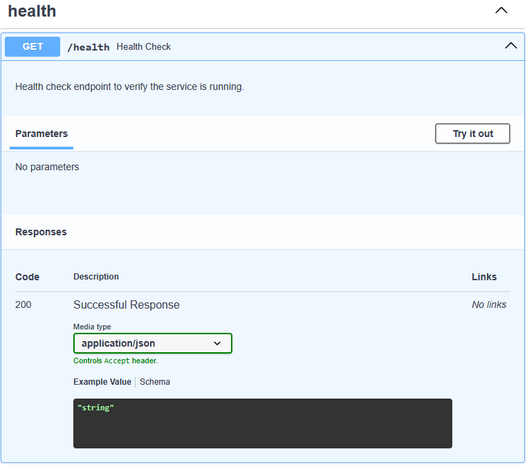

# fargate-api-tryout

### About
This repo is a basic starter template for a REST API built using the FastAPI framework.

### Local Development

#### Environment
Use `pipenv install` and `pipenv shell` to setup the local environment with all dependencies.

#### Running the API
Invoke `make rund` to spin up the API locally. View the Dockerfile to see how the container is defined.

If you have the [REST Client](https://marketplace.visualstudio.com/items?itemName=humao.rest-client)
 extension installed on VSCode, you can make use of the requests defined in the *examples* folder.
For example, executing `health.http` should give you the following:

```
HTTP/1.1 200 OK
date: Fri, 30 May 2025 19:14:04 GMT
server: uvicorn
content-length: 20
content-type: application/json
connection: close

{
  "status": "healthy"
}
```

#### OpenAPI Documentation
View all supported API endpoints by visiting the OpenAPI UI at http://localhost:8080/docs

Example:


#### Code Quality
Use `pre-commit install` to set up the pre-commit hook which include `mypy` and `ruff` for you for static-type checking and linting & formatting respectively.
